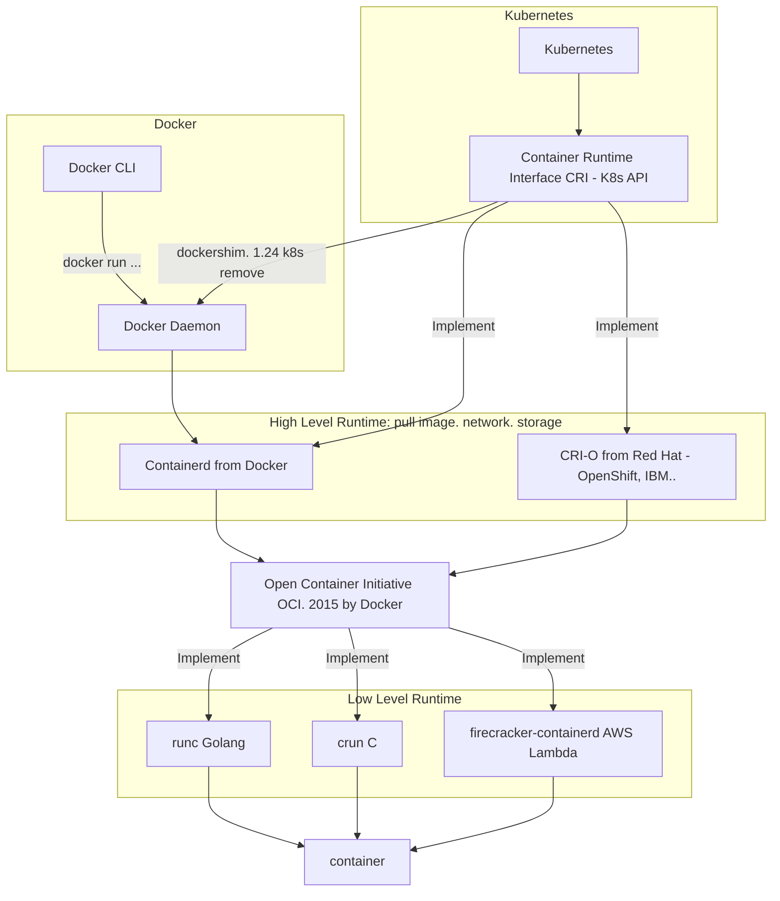

Một số tìm hiểu ban đầu về k8s. 

1. Mối liên hệ giữa containerd và docker
- k8s đang 

```mermaid
graph TD;
    A[Docker CLI]-->|docker run ...|B[Docker Engine];
    B[Docker Daemon];
    B -->C[Containerd];

    C --> D[Open Container Initiative OCI. 2015 by Docker];
    D --> |Implement|E[runc Golang];
    D --> |Implement|CR[crun C];
    D --> |Implement|FC[firecracker-containerd AWS Lambda];

    E --> CO[container]
    CR --> CO[container]
    FC --> CO[container]

    F[Kubernetes] --> G[Container Runtime Interface CRI - K8s API];
    G-->|dockershim. 1.24 k8s remove|B
    G -->|Implement| C[Containerd from Docker];
    G --->|Implement| H[CRI-O from Red Hat - OpenShift, IBM..];
    H --> D

    subgraph Docker
    A
        B
        
    end

    subgraph High Level Runtime: pull image. network. storage
        C
        H
    end

    subgraph Low Level Runtime
        E
        CR
        FC
    end

    subgraph Kubernetes
        F
        G
    end
```