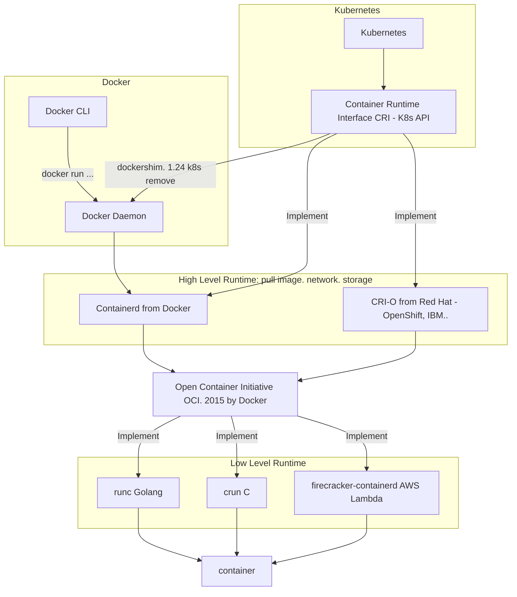

Một số tìm hiểu ban đầu về k8s. 

1. Mối liên hệ giữa containerd và docker

- Low level run time hiện tại chủ yếu là runc
- High level runtime hiện tại chủ yếu là dùng containerd

- k8s đang bỏ docker runtime từ bản 1.24
- bỏ k có nghĩa là phải chỉnh lại docker-formatted container (tức là chuẩn dọckerfile vẫn được giữ nguyên)
- cả containerd và CRI-O điều có thể chạy docker-formatted và OCI-formatted images, chỉ khác là nó có thể chạy mà không cần dùng đến lệnh docker của docker daemon

- [bài đánh giá chi tiết](https://vineetcic.medium.com/the-differences-between-docker-containerd-cri-o-and-runc-a93ae4c9fdac)

2. Mô hình các thành phần của container

Hiểu đơn giản container: nhóm các process với nhau để cô lập

Lịch sử hình thành container: 

- không muốn mất công tạo ra thêm một VM để mọi thứ hoàn toàn độc lập 
- muốn quản lí các môi trường độc lập một cách nhẹ nhàng hơn (tương tác trực tiếp)

Phân biệt ảo hóa và Container: 
- ảo hóa làm việc với VM, container làm việc trực tiếp với các process

Docker trong bức tranh tổng quát về container: 

Trước kia thì docker bao gồm 3 phần: 
- Quản lí image, network, volume (giờ nó chuyển dịch sang chỉ quản lí phần này - ngang hàng chức năng nhiệm vụ với K8S)
- container manager -> chuyển sang dùng containerd (CNCF)
- container runtime -> chuyển sang runc (CNCF)

Mình có câu hỏi mở này dành cho các bạn: tại sao trong container không chạy đc systemd ?

3. Các thành phần của k8s

Mình giới thiệu một mô hình cơ bản của K8S

Sẽ bao gồm các thành phần cơ bản sau: 

- Runtime (containerd)
- kubelet: chạy ở các node 
- Master: etcd(database - lưu trữ thông tin cụm), scheduler, api-server, controler
- HA cho api-server: có thể dùng nginx hoặc haproxy, kết hợp keepalived 
- Kube-proxy

Chi tiết về tương tác các thành phần, network, volume... mình xin hẹn các bạn tại một tương lai xa :D

